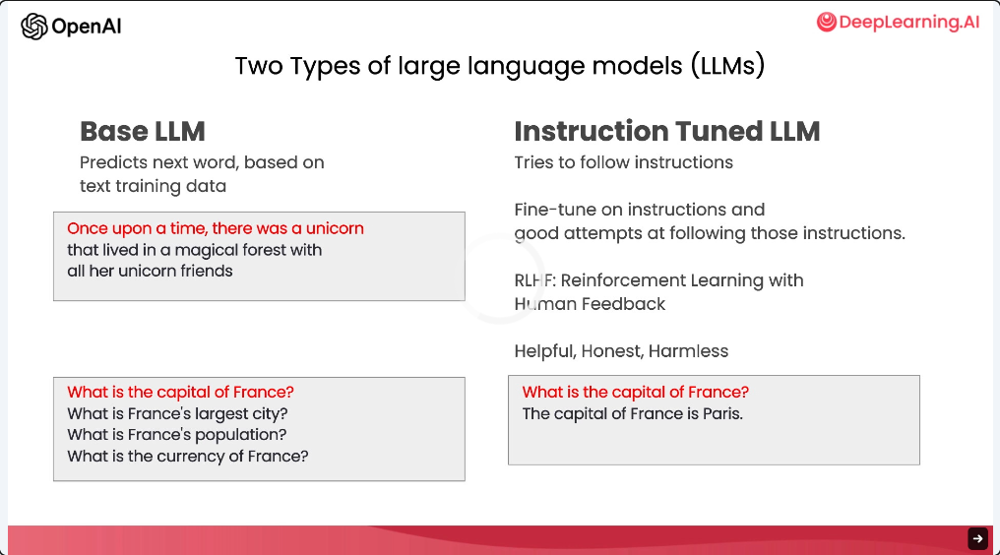

# 引言 (Introduction)

**吴恩达**：欢迎来到这门面向开发者的 ChatGPT 提示工程课程。很高兴能邀请到 Isa Fulford 和我一起授课。Isa 是 OpenAI 的技术人员，她开发了广受欢迎的 ChatGPT 检索插件（Retrieval plugin），并且她的工作重点之一就是教大家如何在产品中应用大语言模型（LLM）技术。她还参与编写了教大家如何编写提示词的 OpenAI Cookbook。Isa，非常高兴你能来。

**Isa Fulford**：我也非常荣幸能来到这里，和大家分享一些提示工程的最佳实践。

**吴恩达**：目前互联网上已经有了很多关于提示词的资料，比如“每个人都必须知道的 30 个提示词”之类的文章。不过，这些资料大多集中在 ChatGPT 的网页界面上，很多人只是用它来完成具体的、通常是一次性的任务。但我认为，大语言模型作为开发者工具的巨大潜力——也就是通过 API 调用大语言模型来快速构建软件应用——目前仍然被严重低估了。

事实上，我在 AI Fund 的团队（DeepLearning.ai 的姊妹公司）一直在与许多初创公司合作，将这些技术应用到各种不同的应用场景中。看到开发者能通过大语言模型接口（LLM APIs）如此迅速地构建出新功能，真是令人兴奋。因此，在这门课程中，我们将分享一些你可以实现的无限可能，以及如何实现它们的最佳实践。

我们要介绍的内容非常丰富。首先，你将学习一些用于软件开发的提示工程最佳实践，然后我们将涵盖一些常见的用例，包括摘要（Summarizing）、推断（Inferring）、转换（Transforming）和扩展（Expanding）。最后，你将使用大语言模型构建一个聊天机器人。我们希望这能激发你的想象力，去构建全新的应用。

在大语言模型（LLM）的发展过程中，大致有两种类型，我统称它们为“基础大模型”（Base LLMs）和“指令微调大模型”（Instruction-tuned LLMs）。

基础大模型通常是在互联网或其他来源的海量数据上进行训练的，它的目标是根据训练数据预测下一个词及其出现的概率。例如，如果你输入的提示词是“很久很久以前，有一只独角兽”，它可能会预测接下来的词是“它生活在森林里，和它的独角兽朋友们在一起”。但是，如果你问它“法国的首都是哪里？”，受互联网文章（如测验列表）的影响，它很可能会补全为“法国最大的城市是什么？法国的人口是多少？”等问题，因为它认为这只是一个关于法国的测验清单。

相比之下，指令微调大模型则是目前大语言模型研究和实践的主要方向。这类模型经过专门训练，学会了遵循指令。因此，如果你问它“法国的首都是哪里？”，它更有可能回答“法国的首都是巴黎”。

指令微调大模型的训练过程通常是：先有一个在大规模文本数据上预训练的基础大模型，然后使用包含“指令”及其“对应正确尝试”的输入输出来进一步微调它。之后，通常还会使用一种名为“人类反馈强化学习”（RLHF）的技术来进一步完善系统，使其更具帮助性且更能遵循指令。因为指令微调大模型被训练得更加乐于助人、诚实且无害，相比基础大模型，它们不太可能输出有害的、有问题的文本。因此，目前大多数实际应用场景都已经转向了指令微调大模型。互联网上的某些最佳实践可能更适合基础大模型，但对于现在的绝大多数实际应用，我们建议大家关注指令微调大模型，因为它们更容易使用，而且经过 OpenAI 等公司的努力，它们变得更安全、更对齐。

因此，本课程将重点关注指令微调大模型的最佳实践，这也是我们推荐你在大多数应用中使用的模型。

在开始之前，我想感谢来自 OpenAI 和 DeepLearning.ai 的团队成员，他们为 Isa 和我将要展示的材料做出了巨大贡献。我非常感谢 OpenAI 的 Andrew Mayne、Joe Palermo、Boris Power、Ted Sanders 和 Lillian Weng，他们深入参与了头脑风暴和课程内容的审核。我也要感谢 DeepLearning.ai 团队的 Geoff Lodwig、Eddy Shyu 和 Tommy Nelson。

当你使用指令微调大模型时，可以把它想象成在给另一个人下达指令，比如一个聪明但并不了解你具体任务细节的人。如果模型表现不好，有时是因为指令不够清晰。例如，如果你只是说“请给我写点关于艾伦·图灵（Alan Turing）的内容”，这可能还不够。更有效的做法是明确你希望侧重他的科学贡献、个人生活、历史地位还是其他方面。如果你还能指定文本的语气，比如是像专业记者的报道风格，还是像写给朋友的一封随笔信，这都能帮助模型生成你想要的内容。

当然，如果你把自己想象成在要求一名刚毕业的大学生来完成这项工作，如果你甚至能提前告诉他们为了写好这段关于图灵的文字需要预读哪些资料，那么这位大学生的成功概率就会更高。

在接下来的视频中，你将看到如何做到“清晰且具体”（Clear and Specific）的示例，这是提示大模型的一个重要原则。你还将从 Isa 那里学到提示工程的第二个原则，即“给模型思考的时间”（Give the model time to think）。

那么，让我们开始下一个视频吧。
