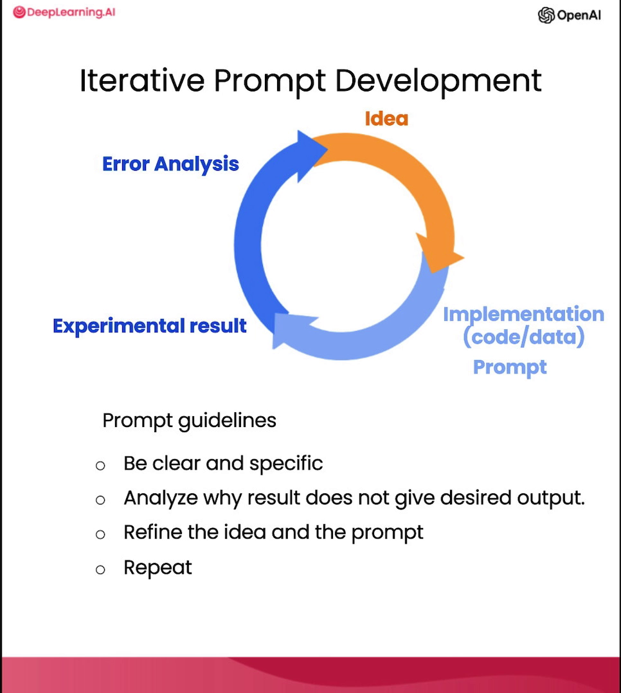
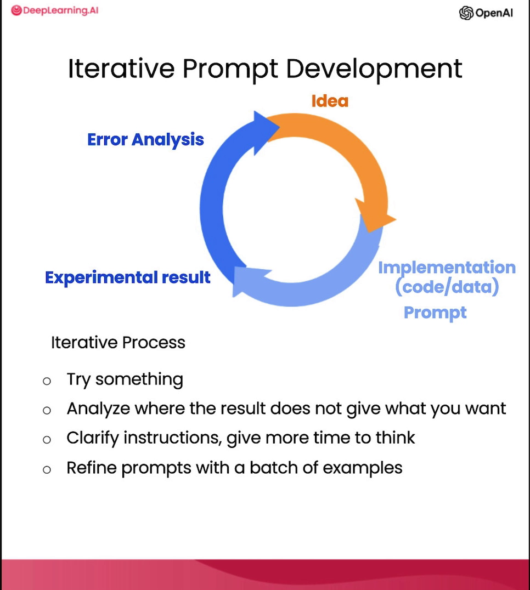

# 迭代开发 (Iterative Development)

**Isa Fulford**：在我使用大语言模型构建应用时，我从来没有在第一次尝试时就写出最终应用中使用的提示词。这其实并不重要。只要你有一个良好的流程来迭代地改进提示词，你就能最终得到一个非常适合你想实现的任务的提示词。

**吴恩达**：你可能听我说过，当我训练机器学习模型时，它几乎从来不会在第一次就完美运行。事实上，如果我训练的第一个模型能直接运行，我会感到非常惊讶。我认为对于提示词（prompting）来说，第一次就成功的概率可能会稍微高一点，但正如我前面所说的，第一个提示词是否有效并不重要，最重要的是找到一个适合你的应用的提示词迭代过程。

那么，让我们进入代码，我来向大家展示一些思考如何迭代开发提示词的框架。

如果你以前上过我的机器学习课程，你可能见过我用这样一张图：在机器学习开发中，你通常有一个想法，然后去实现它（写代码、获取数据、训练模型），这会给你一个实验结果。接着你可以查看输出，进行错误 analysis，找出哪里可行、哪里不可行，甚至可能改变你对要解决的问题或方法的看法。然后更改实现，运行另一个实验，如此反复迭代，最终得到一个有效的机器学习模型。如果你不熟悉机器学习，没见过这张图，也不用担心，这对接下来的内容并不太重要。

但是，当你编写提示词来开发应用时，过程是非常相似的。你对想要完成的任务有一个想法，然后可以初步尝试编写一个提示词，尝试做到清晰具体，并在适当的情况下给系统留出思考的时间。接着运行它，看看结果如何。如果第一次效果不够好，那么通过迭代过程找出原因（例如指令不够清晰，或者没有提供足够的推理空间），让你精炼想法、优化提示词，并多次循环这个过程，直到最后得到一个适合你应用的提示词。

这也是为什么 我个人并不怎么关注那些标榜“30 个完美提示词”的网络文章，因为我认为世界上并没有适用于所有场景的所谓“完美提示词”。更直接、更重要的是，你要有一套为特定应用开发出好提示词的流程。

让我们一起在代码中看一个例子。这里是我在之前视频中用过的基础代码：导入 `OpenAI` 和 `OS`。这里获取 API 密钥，这是和上次一样的辅助函数。

在本视频中，我将以“为一款椅子总结事实说明书（fact sheet）”为例。先把这段文字粘贴进来。

如果你愿意，可以随时暂停视频，在左侧的 Notebook 中仔细阅读。这是一份关于椅子的事实说明书，描述中提到它属于一个美丽的世纪中期风格系列等等。它谈到了构造、尺寸、选配方案、材料等，产地是意大利。

假设你想利用这份说明书，帮助营销团队为在线零售网站撰写一段产品描述。

我先快速运行这三行代码，然后提出如下提示词：

提示词如下：“你的任务是帮助营销团队基于技术事实说明书为零售网站创建一个产品描述……”等等。这是我第一次尝试向模型解释任务。

按下 `Shift+Enter`，运行需要几秒钟。我们得到了这个结果：看起来它在写描述方面做得不错，介绍了这款迷人的世纪中期风格办公椅，是绝佳的补充等等。但当我看到这个结果时，我觉得它太长了。它确实完美执行了我要求它做的事情（根据技术说明书写描述），但我觉得有点冗长。

既然太长了，我产生了一个新想法，并得到了结果。我不满意，于是我会澄清我的提示词，加上一句：“最多使用 50 个词”，以此对所需长度给出更好的引导。让我们再次运行。

好的，这次看起来是一个更简洁、更棒的产品描述。不仅美观而且实用，非常不错。让我检查一下长度：我将回复按空格拆分并统计。结果是 52 个词，其实挺好。大语言模型能够理解长度指令，但在精确遵循字数限制方面并不总是那么完美，不过这已经很合理了。有时它可能会输出 60 或 65 个词，但基本在误差范围内。

你还可以尝试其他方法，比如要求“最多使用 3 句”。

再运行一遍。这些是告诉大语言模型你期望输出长度的不同方式。这里是三句话，看起来做得很好。我也见过有人尝试要求“最多使用 280 个字符”。大语言模型通过“分词器（tokenizer）”来解释文本（这里我不细说），它们在统计字符数方面通常表现平平。

让我们看看：281 个字符，出奇地接近！通常大语言模型没法控制得这么准。这些都是你可以尝试用来控制输出长度的方法。不过，让我把它改回“最多使用 50 个词”。

随着我们继续优化网站文本，我们可能会发现，由于这个网站不是直接面向消费者，而是向家具零售商销售家具，因此他们会对椅子的技术细节和材料更感兴趣。在这种情况下，你可以修改提示词，使其在技术细节上更精确。

继续修改提示词：“此描述针对家具零售商，因此应侧重技术性，关注材料、产品构造……”

运行一下。

效果不错，提到了涂层铝底座、气动椅子、高品质材料等。通过改变提示词，你可以让它专注于你想要的特定属性。

看完之后，我可能决定在描述末尾加上产品 ID。这款椅子有两种型号：SWC-110 和 SWC-100。那么，我可以进一步改进提示词。

为了让它给出产品 ID，我在描述最后加上指令：“在技术规范中包含所有的 7 位产品 ID”。运行一下。

它介绍了办公椅、外壳颜色、塑料涂层、铝底座，并提到了两个产品 ID。看起来非常棒。

你刚才看到的正是许多开发者都会经历的提示词迭代开发的简短示例。

我认为一个指导方针是：在上一段视频中，Isa 分享了一些最佳实践。我通常会把这些实践记在脑子里（清晰具体，必要时给模型思考时间）。带着这些想法，先尝试初步编写一个提示词，看看效果，然后从那里开始迭代优化，使其越来越接近你想要的结果。许多在各种程序中看到的成功的提示词，都是通过这样的迭代过程产生的。

开个玩笑，让我给你们看一个更复杂的提示词示例，让大家感受一下 ChatGPT 能做什么：我在最后又加了一些额外指令，比如在描述后包含一个提供产品尺寸的表格，并整体格式化为 HTML。运行一下。

在实践中，只有经过多次迭代，你才会得到这样一个复杂的提示词。我认为没人能一步到位地写出这样的提示词。

这里输出了一堆 HTML。我们显示一下这些 HTML，看看它是否有效。哇，太酷了！渲染出来了。它有非常精美的椅子描述、构造、材料以及产品尺寸表格。

哦，看来我漏掉了“最多使用 50 个词”的指令，所以稍微长了点。但如果你想修改，可以暂停视频，告诉它更简洁些并重新生成。

我希望大家能通过这段视频意识到，提示词开发是一个迭代过程。尝试一些方案，看看它离你的目标还差多少，然后思考如何澄清指令，或者在某些情况下思考如何给它更多思考空间。

我认为，成为一个高效的提示词工程师，关键不在于掌握所谓的“提示词大全”，而在于拥有一套能够为你的应用开发出有效提示词的良好流程。

在这段视频中，我只用一个例子演示了开发过程。对于更复杂的应用，有时你会有多个例子，比如 10 个、50 个甚至 100 个事实说明书，然后在这一组案例上迭代开发并评估提示词。但在大多数应用的早期开发阶段，我看到许多人都是像我刚才这样用一个例子来开发的。而对于更成熟的应用，针对更大的样本集进行测试会更有用，比如在几十个说明书上测试，看看提示词在平均情况或最差情况下的表现如何。但通常只有在应用较为成熟、需要指标来推动最后那几步微小改进时，才会这样做。

那么，请大家亲自去玩一玩 Jupyter Notebook 的代码示例，常规设定各种不同的变体。完成后，让我们进入下一个视频，讨论大语言模型在软件应用中一个非常常见的用途：文本摘要。
