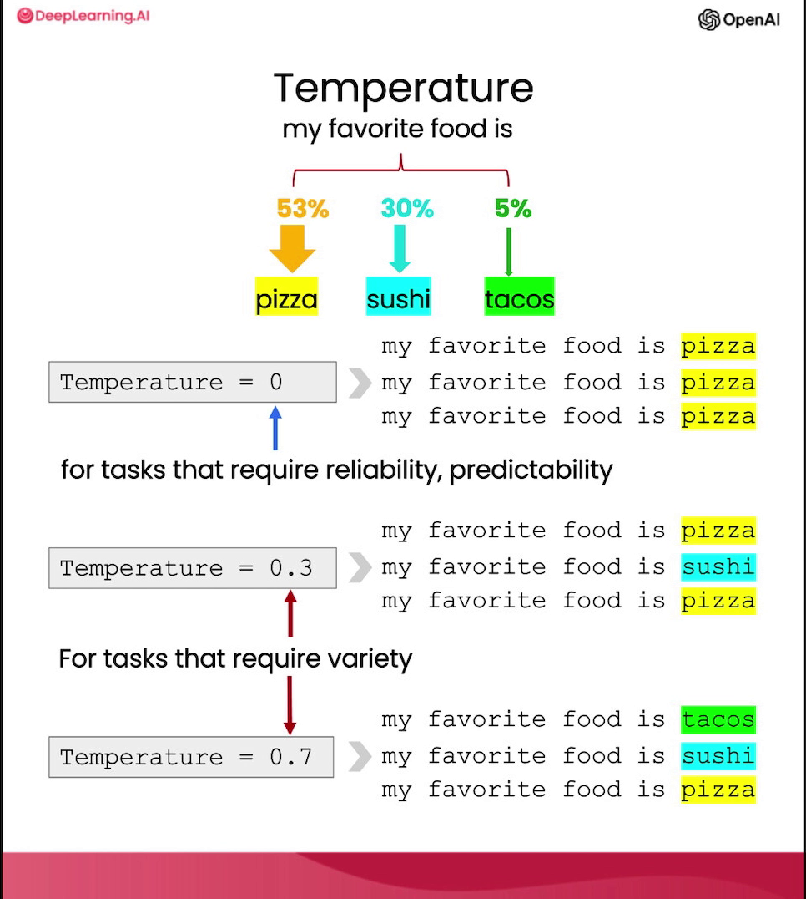

# 内容扩充 (Expanding)

**吴恩达**：**扩充**（Expanding）是指将一段较短的文本（如一组指令或主题列表），交给大语言模型生成一段较长的文本（如关于某个主题的电子邮件或文章）。这有很多很棒的用途，比如将大语言模型作为头脑风暴的伙伴。但我也不得不承认，这也有一些有问题的用例，比如有人用它来生成大量的垃圾邮件。因此，当你使用大语言模型的这些功能时，请务必以负责任的方式使用，并以帮助他人的方式使用。

**Isa Fulford**：在本视频中，我们将通过一个例子展示如何利用语言模型根据某些信息生成个性化的电子邮件。正如吴恩达提到的，非常重要的一点是，这封邮件会明确声明是由“AI 机器人”发送的。我们还将使用另一个模型输入参数，叫做 **Temperature**（温度），它允许你改变模型响应的探索程度和多样性。让我们开始吧！

在开始之前，我们进行常规设置：设置 `OpenAI` Python 包并定义辅助函数 `get_completion`。

现在我们要为客户评论写一段自定义的回复邮件。给定客户评论和情感，我们将生成自定义响应。我们将提取评论的情感（使用我们在推断视频中看到的提示词），这里使用的是关于搅拌机的客户评论。

我们将根据情感定制回复。指令是：“你是一个客户服务 AI 助手。你的任务是向宝贵的客户发送电子邮件回复。给定由三个反引号分隔的客户邮件，生成回复以感谢客户的评论。如果情感是正面或中性的，感谢他们的评论；如果情感是负面的，表示歉意并建议其联系客服。确保使用评论中的具体细节，写作语气简练且专业，并署名为‘AI 客户代理’”。

当你使用语言模型生成要展示给用户的文本时，这种透明度非常重要，要让用户知道他们看到的文本是由 AI 生成的。

我们输入客户评论和评论情感。值得注意的是，其实我们也可以直接用这一个提示词来同时提取情感并编写邮件，但为了演示方便，这里假设我们已经提取好了情感。结果显示，模型生成了一封回复邮件，引用了客户评论中的细节，并按照指令建议在必要时联系客服。

接下来，我们将使用模型的一个参数叫 **Temperature**。你可以将 Temperature 看作模型响应的探索程度或随机程度。比如对于“我最喜欢的食物是”这一句，模型预测概率最高的下一个词是“比萨（pizza）”，次高的是“寿司（sushi）”和“塔可（tacos）”。

在 Temperature 为 0 时，模型总是会选择预测概率最高的下一个词，也就是“比萨”。在较高的 Temperature 下，它有时也会选择概率较低的词；在更高的 Temperature 下，它甚至可能选择只有 5% 概率的“塔可”。

随着模型继续生成后续的词，“我最喜欢的食物是比萨”和“我最喜欢的食物是塔可”这两段文本会变得越来越不同。

通常情况下，在构建需要结果可预测、稳定的应用时，我建议使用 **Temperature 为 0**。在本课程的所有视频中，我们一直都在使用 Temperature 0，我认为如果你想构建一个可靠且可预测的系统，应该坚持这样做。但如果你想以更具创意的方式使用模型，希望获得更广泛的多样化输出，那么可以使用较高的 Temperature。

现在让我们尝试使用较高的 Temperature 生成同一封邮件。在 `get_completion` 函数中，我们指定 Temperature 为 0.7。在 Temperature 为 0 时，每次执行相同的提示词都会得到相同的补全结果；而 Temperature 为 0.7 时，每次都会得到不同的输出。

看看结果，生成的邮件与之前不同了。再次执行，又会得到另一封不同的邮件。我建议大家亲自尝试调整 Temperature，看看输出是如何变化的。

总结一下：Temperature 越高，模型的输出就越随机。你可以粗略地认为，在较高的 Temperature 下，AI 助手更容易“分心”，但也可能会更有创意。

在下一个视频中，我们将更多地讨论聊天补全（Chat Completions）端点的格式，以及如何利用这种格式创建一个自定义聊天机器人。
