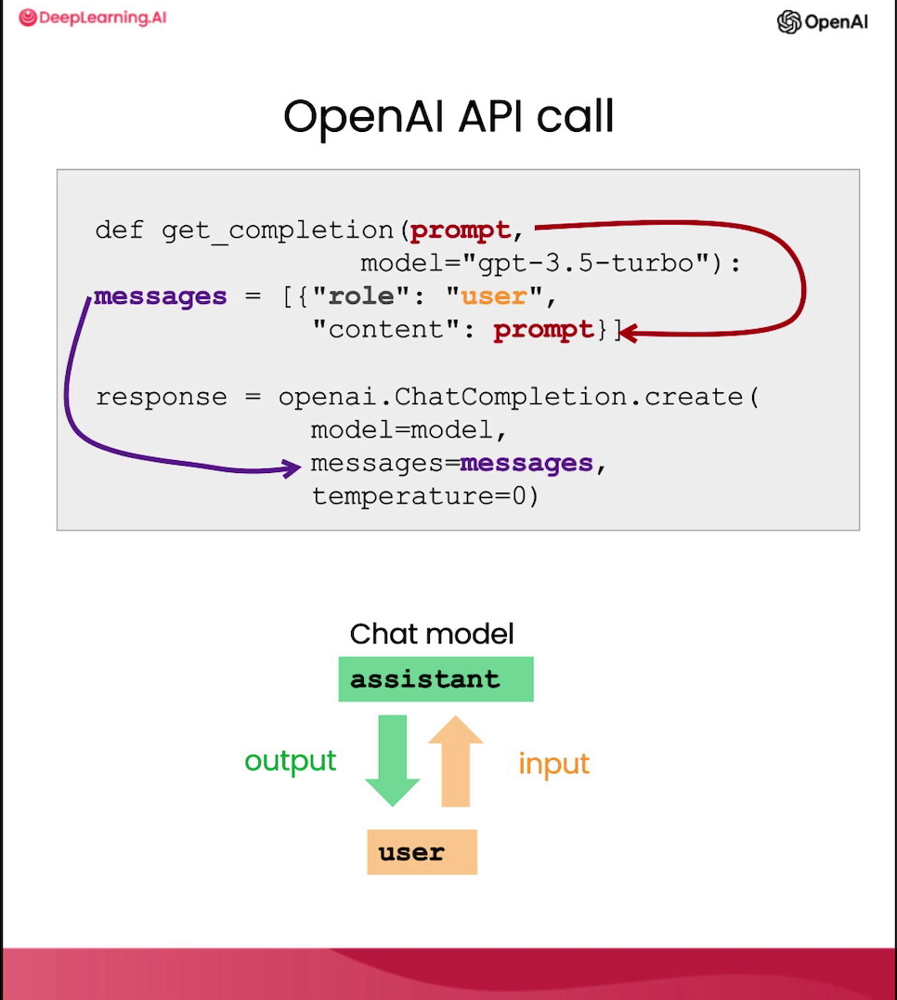
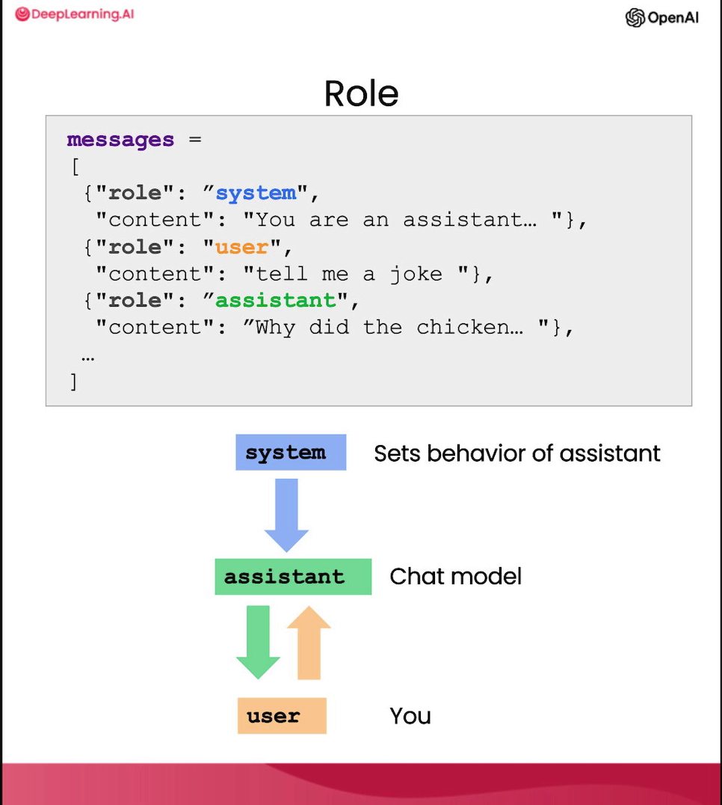

# 自定义聊天机器人 (Chatbot)

**吴恩达**：大语言模型最令人兴奋的事情之一是，你可以仅用少量的努力就构建一个自定义机器人。ChatGPT 的网页界面就是一个让你通过大语言模型进行对话的交互界面。但最酷的是，你也可以构建一个自定义聊天机器人，扮演 AI 客户服务代理或餐厅 AI 点餐员的角色。在本视频中，你将学习如何亲自实现这一点。

**Isa Fulford**：接下来我将详细讲解 OpenAI 聊天补全（Chat Completions）格式的组成部分，然后由你亲自构建一个聊天机器人。

首先，如往常一样设置 `OpenAI` Python 包。ChatGPT 这样的聊天模型实际上是经过训练的，它们接收一系列消息作为输入，并返回一条由模型生成的消息作为输出。虽然聊天格式的设计是为了让这种多轮对话变得简单，但我们在之前的视频中也看到，它对于没有任何对话的单轮任务也同样有用。

接下来，我们定义两个辅助函数。一个是我们在所有视频中一直使用的 `get_completion`。如果你仔细观察它，我们提供了一个提示词（prompt），但函数内部实际上是将这个提示词放入了一个看起来像“用户消息”（user message）的东西里。这是因为 ChatGPT 模型是一个聊天模型，它被训练成接收消息序列作为输入。用户消息是输入，而助手消息（assistant message）是输出。

在本视频中，我们将实际使用一个不同的辅助函数。我们不再输入单个提示词并获得单个补全，而是传入一个消息列表，这些消息可以来自不同的角色。

举个例子：列表中的第一条消息是系统消息（system message），它提供了整体指令；之后是用户和助手之间的交替轮次。如果你用过 ChatGPT 的网页界面，你的消息就是用户消息，而 ChatGPT 的回复就是助手消息。

**系统消息**有助于设定助手的行为和人格，它作为对话的高级指令。你可以把它想象成在助手耳边低语，引导它的反应，而用户并不知道系统消息的内容。系统消息的好处是，它为你（开发者）提供了一种框定对话的方式，而无需将这些指令本身变成对话的一部分。

现在让我们试着平衡这些消息在对话中的运用。我们使用新的辅助函数，并设置较高的 Temperature。系统消息说：“你是一个说话像莎士比亚的助手”。这是我们描述助手应该如何表现。第一个用户消息是：“给我讲个笑话”。接着是：“为什么鸡要过马路？”最后用户说：“我不知道”。

运行结果，助手回答：“为了到另一边去，先生/女士。这是一个经典的老笑话，永不过时。”这就是典型的莎士比亚式回答。为了让大家更清楚这是助手消息，我们可以打印出完整的消息响应。可以看到 `role` 是 `assistant`，`content` 就是消息内容。

再看一个例子。系统消息是“你是一个友好的聊天机器人”，第一个用户消息是“嗨，我叫 Isa”。我们运行并得到助手的回复：“你好 Isa！很高兴见到你。今天我能为你做些什么？”

接着，如果用户继续问：“是的，你能提醒我，我叫什么名字吗？”运行一下，你会发现模型实际上不知道我的名字。这是因为与语言模型的每次对话都是独立的交互，这意味着你必须提供所有相关的消息，模型才能在当前对话中提取信息。如果你想让模型“记住”之前的对话内容，你必须在输入中提供之前的对话。我们把这称为**上下文**（Context）。

现在，我们把名字这个上下文提供给模型。运行后，模型就能回答出我的名字了，因为它在消息列表中拥有了所需的全部上下文。

现在，你要开始构建自己的聊天机器人了。这个机器人叫“点餐机器人”（OrderBot）。我们将自动化收集用户提示词和助手响应的过程。它将负责一家比萨店的点餐工作。

首先定义一个辅助函数，它会从我们下面构建的 UI 界面中收集用户提示词，将其附加到一个名为 `context` 的列表中，然后每次都带着这个上下文调用模型。模型的响应也会被添加到上下文中。这样，上下文列表会越来越长，模型就有了决定下一步该做什么所需的信息。

现在我们运行这个 UI 来显示点餐机器人。上下文包含系统消息，其中包含了菜单。注意，每次调用模型时，我们都使用相同的上下文，而上下文是随时间累积的。

比如我说：“嗨，我想订餐”。助手会问你想点什么。我们有意大利香肠、奶酪和茄子比萨。询问价格后，我决定点一个中号茄子比萨。

让我们看看系统消息里写了什么：

> **系统提示词**：你是点餐机器人，一个为比萨店收集订单的自动化服务。你先问候客户，然后收集订单，接着询问是自取还是送货。等待收集完整订单后，进行总结并最后确认客户是否还要添加其他东西。如果是送货，询问地址。最后收款。确保澄清所有选项、额外项和尺寸，以便从菜单中唯一识别商品。你的回答风格简洁、口语化且友好。菜单包含：[具体菜单内容]

回到对话，助手会按照指令询问是否需要配料，我回答不需要。接着问还要点别的吗，我点了薯条。助手问大份还是小份，这很好，因为我们在系统消息中要求它澄清额外项和侧菜。

最后，我们可以让模型根据对话创建一个发送给点餐系统的 JSON 摘要。我们再附加一条系统消息作为指令：“对之前的食品订单创建一个 JSON 摘要。列出每项的价格。字段包含：1) pizza 及其尺寸，2) 配料列表，3) 饮料列表，4) 侧菜列表，最后是总价”。顺便说一下，这里也可以使用用户消息，不一定非要用系统消息。

注意，在这种任务中，我们使用较低的 Temperature，因为我们希望输出是相当可预测的。运行之后，我们得到了订单的 JSON 摘要，可以直接提交给点餐系统。

点餐机器人就这样制作完成了！你可以根据需要定制系统消息，改变机器人的行为，让它扮演不同的人格或拥有不同的知识。
