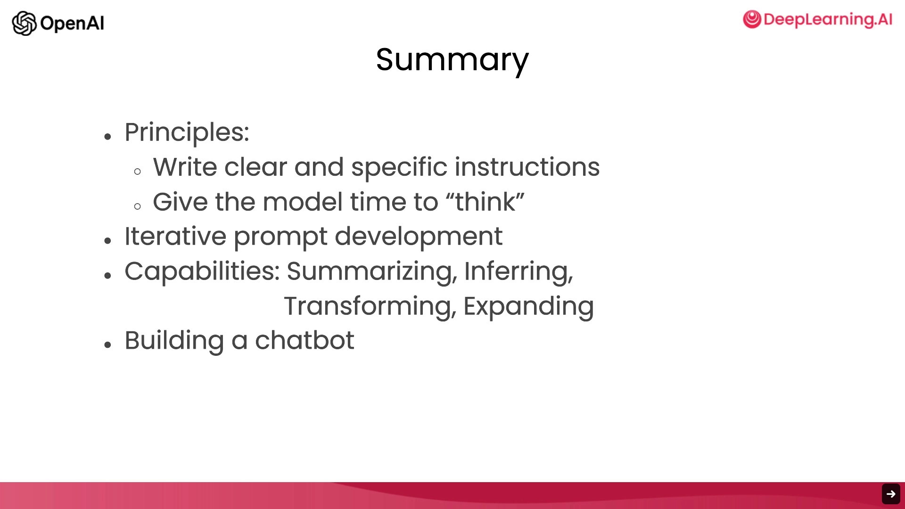

# 结语 (Conclusion)

**吴恩达**：恭喜你学完了这门短课程。总的来说，在这门课程中，你学习了两个关键的提示词原则：编写清晰且具体的指令，以及在适当的时候给模型思考的时间。

**Isa Fulford**：你还学习了迭代式的提示词开发过程，了解了拥有这样一个流程来找到适合你应用的提示词是多么关键。我们还探讨了大语言模型在诸多应用中非常有用的几项功能，具体包括：总结（Summarizing）、推断（Inferring）、转换（Transforming）和扩充（Expanding）。

**吴恩达**：你也学会了如何构建一个自定义聊天机器人。在这一门简短的课程中，你学到了很多东西，我希望你喜欢这些学习材料。

**Isa Fulford**：我们希望能激发你的一些灵感，去亲手构建一些自己的应用。请去尝试一下，并告诉我们你的成果。任何应用都不嫌小，从一个非常小的项目开始完全没问题，哪怕它只有一点点用途，或者甚至没什么实际用处，只是纯粹为了好玩也可以。

**吴恩达**：没错，我发现玩这些模型本身就非常有意思，所以去动手玩玩吧！

**Isa Fulford**：我同意！根据我的经验，这是一个很棒的周末活动。而且，请把在第一个项目中学到的经验教训应用到第二个（甚至第三个）项目中。我自己也是在不断使用这些模型的过程中成长起来的。

**吴恩达**：或者，如果你已经有了一个大项目的想法，那就放手去做吧。作为提醒，大语言模型是一种非常强大的技术，我们当然希望你能负责任地使用它们，请只构建那些能产生积极影响的东西。

**Isa Fulford**：完全同意！我认为在这个时代，构建 AI 系统的人可以对他人产生巨大的影响。因此，我们所有人都必须负责任地使用这些工具。

**吴恩达**：目前，构建基于大语言模型的应用是一个非常令人兴奋且不断发展的领域。学完这门课程后，你已经拥有了丰富的知识储备，这能让你构建出当今很少有人知道如何构建的东西。我也希望你能帮助我们传播这些知识，鼓励其他人也来参加这门课程。

**Isa Fulford**：最后，希望你在学习这门课程的过程中感到快乐，非常感谢你能坚持学完。

**吴恩达**：Isa (艾莎) 和我都很期待看到你构建出的惊人成果！
