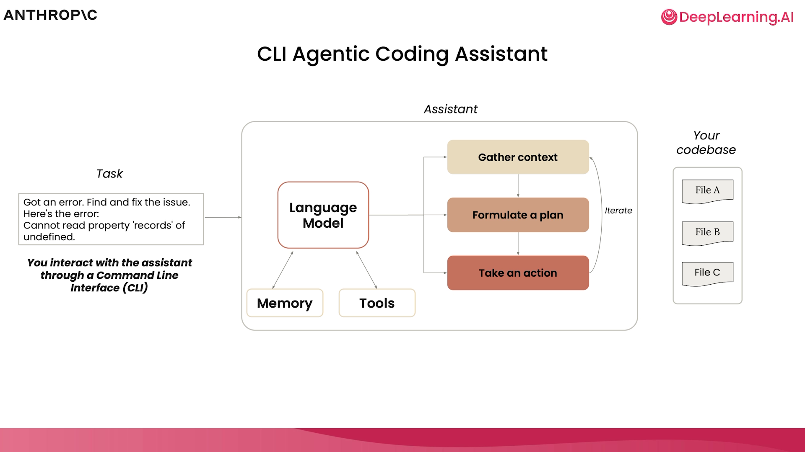
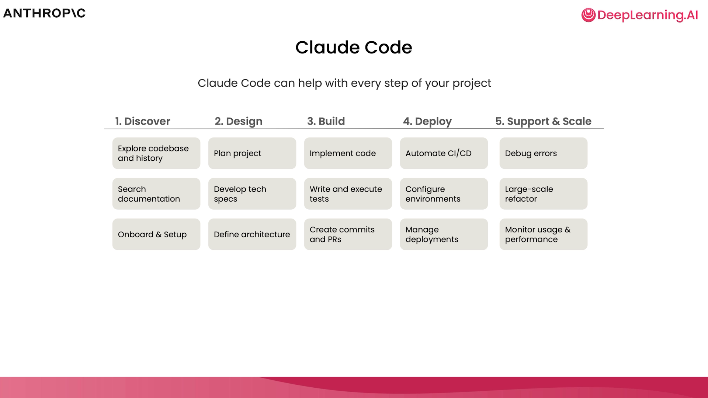
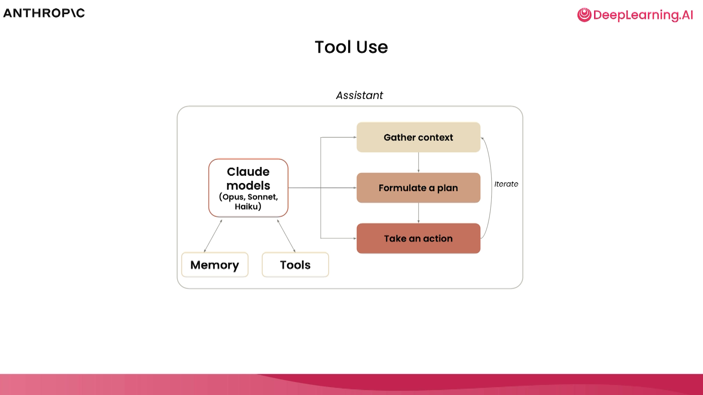
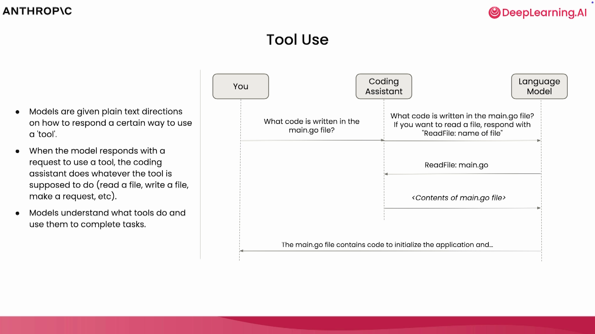
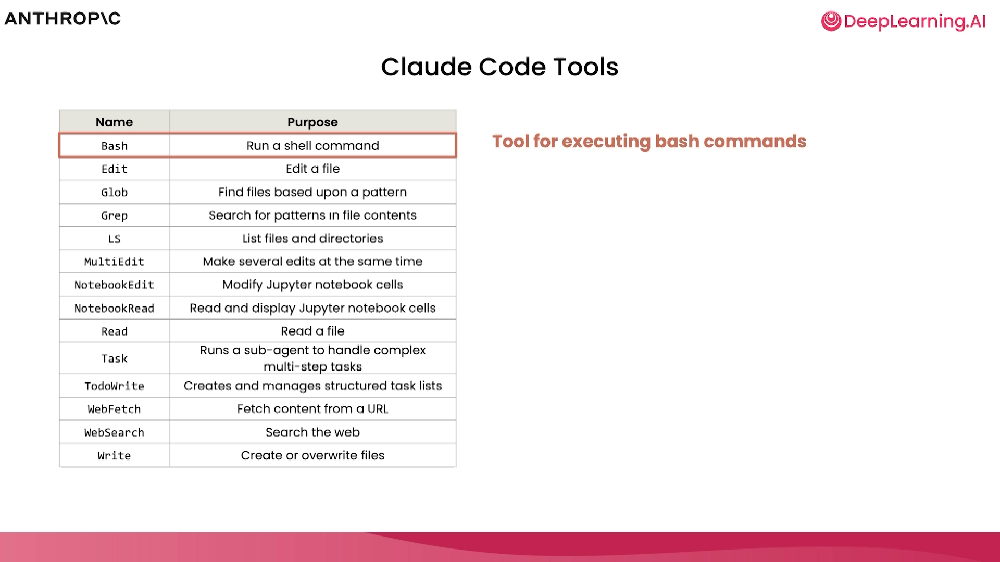
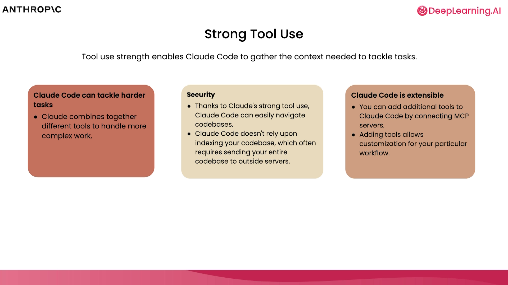
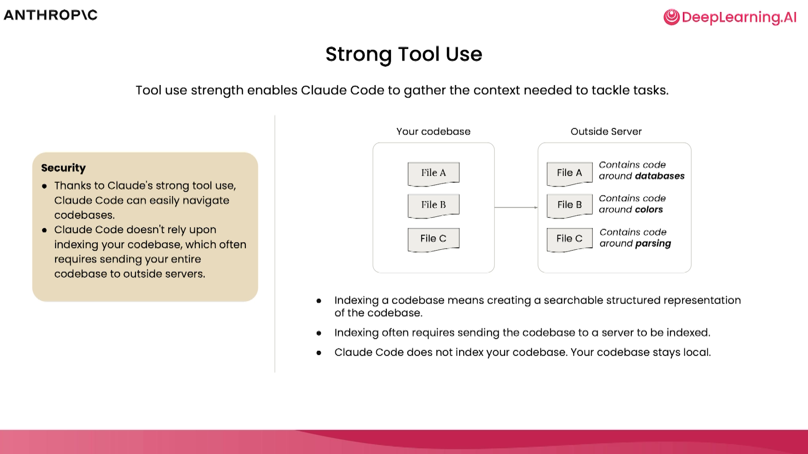
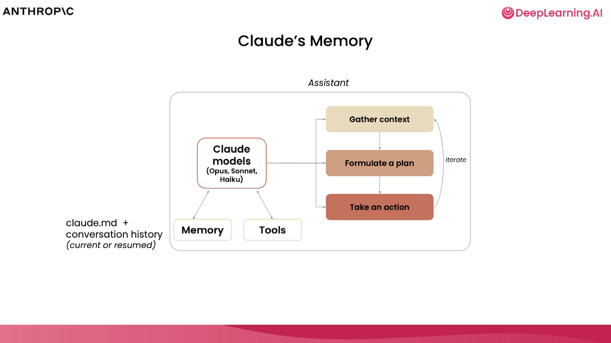
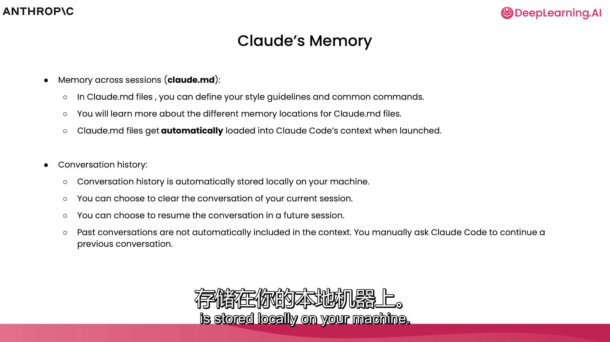

# 课程讲稿：第一节 - 什么是 Claude Code？（全文翻译）

在本节课中，我们将深入了解 Claude Code 的代理化工作流（Agentic Workflow）、它在导航代码库时使用的工具，以及它在跨会话中保持的记忆。让我们开始吧。

首先，让我们聊聊 Claude Code 究竟是什么。当我们谈论代理系统（Agentic Systems）时，我们通常会联想到一个模型、一组工具，以及运行这些工具的环境。

模型擅长处理输入并返回输出。但在许多情况下，这些模型并不了解你的代码库，不知道如何查找文件，也不清楚如何处理多个任务。因此，我们不直接与模型对话，而是为该模型提供一个非常轻量级的“外壳”（Harness）。通过命令行，我们将利用这个外壳来发挥模型的智能，从而执行复杂的编程任务。

所以，我们不是直接把任务交给模型并让它在代码库中费力地搜索各种信息，而是提供一套工具、一个环境以及其他一些功能，使模型能够梳理代码库并解决更复杂的问题。

我们提到的这些功能具体指什么呢？它们包括：赋予模型记忆能力，使其能够记住用户的偏好、正在查看的代码库或当前的任务；同时，我们还为模型提供一个环境，让它能自主搞清楚需要什么数据、制定计划并采取行动。只需少量的代码，我们就可以利用模型的智能来取得非常显著的效果。

在使用 Claude Code 时，你可以根据任务的复杂程度和你的订阅情况，选择使用 Claude 3 Opus 或 Sonnet 模型。

谈到 Claude Code 的功能时，人们很容易认为这只是一个用来写大量代码的工具。但随着课程的进行，你会发现我们将从 Claude Code 最强大的功能之一开始，那就是它的**发现（Discover）、解释（Explain）和设计（Design）**能力。在你开始使用 Claude Code 编写代码之前，可以先利用它来快速熟悉一个代码库。

虽然我们会花很多时间讨论如何用 Claude Code 编写代码，但我们也会讨论如何并在终端之外的环境（如 GitHub）中使用它。我们还会探讨代码重构、调试错误以及该工具真正大放异彩的场景。它不仅对编程有用，在数据分析以及任何模型智能可以为你创建引人入胜的可视化、资产或交付物的环境中都非常有用。

前面提到我们给模型提供了一个外壳、一个收集上下文并采取行动的环境，以及我们为模型提供的记忆。稍后我们会详细介绍底层记忆的结构。

现在，让我们聊聊我们让模型了解的工具或附加功能。为了直观说明工具的使用，你可以想象用户询问某个特定文件中写了什么代码。模型本身并不知道如何导航或查找文件，这时“工具调用”（Tool Use）就派上用场了。

Claude Code 开箱即用地提供了一组相对精简的工具。其中之一就是读取文件的能力。现在模型知道该做什么了，它可以直接去读取该文件，获取文件内容，并将数据返回给用户。这种工具调用的能力使模型从一个简单的助手转变为一个极其复杂的代理化工具。

以下是 Claude Code 内置的工具列表：有些用于跨不同类型的文件进行编辑；有些用于读取不同文件；还有一些用于执行额外操作，比如查找模式、进行网页搜索，甚至创建或运行子代理来处理非常困难和具有挑战性的任务。最后，因为我们在命令行中操作，我们还需要一个执行 Bash 或 Shell 命令的工具。

正是工具调用让 Claude Code 能够收集所需的上下文和信息，从而解决更棘手的问题。这也使得 Claude Code 不需要索引你的整个代码库，从而避免了潜在的安全风险。

此外，Claude Code 具有很强的可扩展性。虽然你刚才看到了内置的工具列表，但你还可以通过连接到 MCP 服务器来添加额外的工具。MCP（Model Context Protocol，模型上下文协议）是一个开源的、与模型无关的协议，它允许数据和 AI 系统之间轻松通信。这些 MCP 服务器可以为 Claude Code 添加处理各种任务的功能，我们将在本课程中探索其中的一些。

我想再多花一点时间来解释一下“不索引代码库”是什么意思。Claude Code 不会创建代码库的结构化表示并不断对其进行分析，而是使用一种称为“代理化搜索”（Agentic Search）的功能。它不需要将代码库发送到服务器并可能离开你所在的生态系统，而是使用一个或多个不同的代理和工具集在你代码库中实时寻找它想要的内容。这使得你的代码不必完全加入上下文，也不必离开它所在的环境，从而解决了某些安全顾虑。

谈到 Claude 的记忆或它记住之前对话或操作的能力时，这是通过一个名为 `claude.md` 的 Markdown 文件实现的。在 `claude.md` 文件中，你可以定义通用的配置或风格指南。这些文件在启动时会自动加载到上下文中。你与 Claude Code 的对话存储在你本地的机器上。你可以在对话过程中清除它，以便从一个新的上下文窗口开始。但如果出于某种原因，你需要继续之前的对话或恢复早期的交流，你也可以轻松做到。

现在，我要切换到 VS Code 内部的终端。你可以看到我这里有一个名为 `demo` 的文件夹，里面什么都没有。首先，我们使用 `claude` 命令启动 Claude Code。根据文件所在位置，特别是第一次运行时，它可能会询问我是否信任该文件夹中的文件，我选择信任。

我们在这里得到了一些不错的入门提示，但我将从一个非常简单的提示词开始：“为我做一个酷炫的可视化效果（Make a cool visualization for me）。”

我们将看到 Claude Code 开始制定一系列操作的待办清单。你可以想象，这个任务可能是搜索代码库、编辑文件、编写测试、提供见解，或者在我们的案例中，是创建一个可视化效果。根据 Claude 的“心情”，它可能会制作粒子效果、烟花或其他东西，但我只是想向你展示开箱即用的 Claude Code 能以多快的速度看到变化。

因为我们在 Visual Studio Code 内部操作，并且 Claude Code 与该编辑器有集成，我们将能直观地看到代码的变化。我会接受这些更改，在之后的演示中，我会让 Claude Code 直接操作而不再请求我的许可。

我们可以看到，一个可视化效果已经构建好了。让我们在浏览器中打开它。我会让 Claude Code 帮我打开，它会确认命令。让我们看看效果。

现在，我们的可视化效果出来了。可以添加一些粒子，看起来更棒了。你可以切换动画，查看运行情况，并清除当前内容。我们可以根据需要对它进行任意扩展，改变功能，或者添加任何我们想要的内容。

但我展示这些只是为了让你看到，使用这个工具上手并运行起来是多么无缝。

在下一节课中，我们将探索如何跨更大的代码库使用 Claude Code，并退后一步，看看它在解释更大、更复杂的代码库方面是多么强大。
