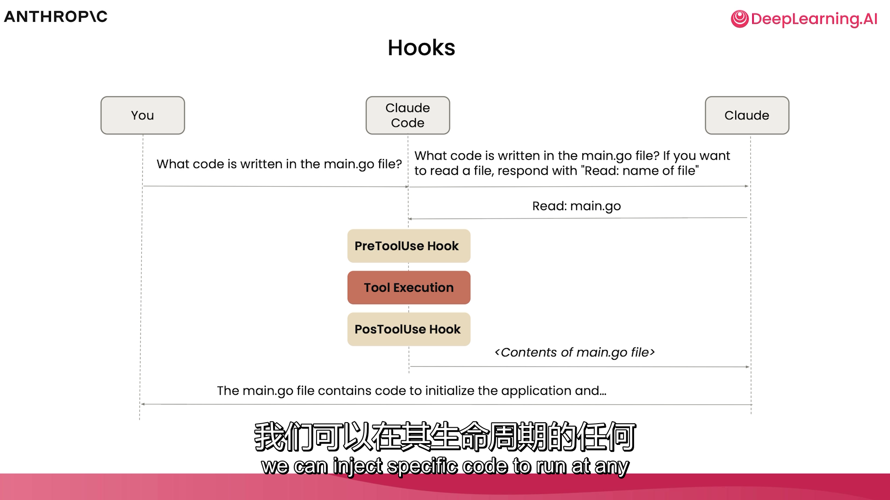

# 课程讲稿：第七节 - 探索 GitHub 集成与钩子（全文翻译）

在本节课中，你将学习如何通过 GitHub 集成在终端之外使用 Claude Code。你将看到如何设置 Claude Code 来审查拉取请求（PR）并修复 GitHub 中的问题。随后，你还将学习如何通过 Claude Code 钩子（hooks）在调用工具前后执行特定的代码。让我们深入了解。

我们在上一节结束时将 worktrees 合并到了一起，但我们忘记让 Claude 移除这些 worktrees 了。所以我们要重新回到 Claude。我将使用 `--resume` 标志回到之前处理 worktrees 的对话中。

> `claude --resume` 之后有各个时间保存点可以选择进入之前的会话工作状态。
>
> 由于经常使用 `/clear` 因此就是选择回到哪个会话继续。

在这个特定的对话中，我们可以回到之前的位置，并完成移除 worktrees 的工作。让我们要求 Claude：“移除 `.trees` 文件夹及其包含的 worktrees，完成后将代码推送到 GitHub。”

让我们给 Claude Code 一点时间来运行必要的 Git 命令，以移除该文件夹并将合并后的代码推送到 GitHub。我们将授予 Claude Code 访问权限以查看底层的 worktrees，这样我们不仅能移除 worktrees，还能删除对应的分支。

我们现在移除这些分支 tree、移除目录，然后删除底层的分支。完成后，让我们检查一下是否符合预期。很好，文件夹已经不在了。现在，让我们把代码推送到 GitHub。我们确认要运行 `git push origin main` 命令，看来代码已经推送到 GitHub 了。

现在我们已经提交并推送了代码，让我们开始安装 Claude Code 附带的 GitHub 集成。我将使用 `/install-GitHub-app` 命令。在这里你可能会看到需要使用命令行界面进行额外的身份验证。如果你看到了这些设置指令，请务必遵循。

> 我的没有这个命令。

我们现在可以为当前正在处理的仓库安装 GitHub App。让我们开始操作。这会打开浏览器，如果我还没有配置过，会有安装选项。

这项集成允许我们在拉取请求（PR）和议题（Issues）中使用 Claude Code，以响应反馈、修复错误、修改代码等等。为了实现这些功能，它是构建在 Claude Code 附带的软件开发工具包（SDK）之上的。这个 SDK 允许你在终端界面之外使用 Claude Code。

让我们回到终端，指定我们想要安装的工作流。这些工作流允许在议题中标记 Claude，并利用 Claude 自动审查 PR 中的代码。我们两个都安装。我们将创建一个长效令牌（long-lived token），在这里我们需要与 Claude 进行授权和身份验证。

完成后回到终端，我们会看到它正在创建仓库信息，设置所需的额外信息，并直接把我带回 GitHub 去开启一个带有刚才所做更改的拉取请求。

我们可以看到，这个拉取请求会自动允许 GitHub Actions 进行错误修复、编写测试和代码审查。如果我们愿意，可以更改这些设置，或者直接使用默认信息创建 PR。

在拉取请求中，我们可以看到不仅创建了一个让 Claude 运行的 YAML 文件，还有一个用于代码审查的文件。在这里我们可以看到它提供了一些非常合理的默认设置。我们可以按作者过滤，也可以指定运行环境。开箱即用的功能已经非常丰富了。

如果你想修改代码审查中的提示词，可以在这里进行。由于这是一个由 Git 追踪的文件，你可以根据需要不断对其进行编辑。我现在要将其合并，以便开始在 GitHub 中使用 Claude Code。

我们可以直接看到一个 Claude GitHub Action 已经启动了。这就是我们在未来的 PR 中会看到的。它会读取并分析文件、检查代码质量、识别安全隐患。现在我们有了一个新队友——Claude，来检查我们和其他团队成员的工作。

这有时需要一点时间启动，但一旦完成，我们会从 Claude 那里得到详细的评估，并在准备好时合并 PR。审查看起来已经完成了。根据我们给它的提示词，我们可以指定想要的信息深度。我们能看到哪些地方做得好，以及一些可能需要的考虑因素。如果看起来没问题，我们就可以合并该 PR。

从现在开始，在未来的 PR 中，Claude 都会帮助审查我们的代码。当人类可能遗漏某些细节，而你需要额外的一步来检查一切是否按预期工作时，这非常有用。

假设出现了一个问题。我们团队中的某人添加了一个新议题（Issue）。我们可以在 GitHub 中操作，甚至可以在 Claude Code 中操作。

你可能已经注意到，随着我们在这个应用上不断构建，我们看到了一个新添加的页眉（header）。这个新页眉看起来可能还不错，但也许我们想恢复到之前的状态。所以让我们添加一个议题，看看 Claude 能否帮上忙。

假设我们这里有一个议题：应用添加了一个新页眉，让我们恢复到旧版本。确保保留主题切换按钮，但让页眉看起来像以前一样。我们还会指定：确保移除“Course Materials Assistant”页眉，移除子页眉，移除询问问题的部分，然后移除子页眉下方的水平线。

创建议题后，我们可以指派某人去处理，但为什么不直接请 Claude 帮忙呢？“Claude，你能帮我修复这个吗？”一旦我们标记了 Claude，就要给它一点时间来修复这个问题。

当 Claude 修复好该议题后，它应该能够生成一个 PR。让我们给 Claude 的 Action 一点运行时间。我们可以看到 Claude Code 正在工作。如果你想查看正在运行的底层作业，也可以点击查看。

你所看到的界面与我们在命令行中看到的非常相似：分析结构、移除页眉。我甚至可以根据需要选择优先级。你在终端之外看到的是同样的事情。我们不仅可以利用 Claude 处理议题和 PR，还可以像之前看到的那样利用它审查代码。

当我们开始查看它的计划时，会注意到正在进行的更改、在代码库中提议的位置。看到 PR 时，我们可以看到背后的一些思考和逻辑。看来这个任务并不难，它会遵循这些步骤：测试更改、提交并推送。

现在它已经完成了必要的提交。我们可以看到底层的描述信息。如果我们愿意，可以创建这个 PR，或者让 Claude 帮我们完成所有工作。创建 PR 后，我们可以看到提交中生成的具体内容。

现在让我们去看看 Claude 做了什么。我们可以查看更改过的底层文件。这里改动不大，我们可以将其合并。正如之前看到的，Claude 还会花时间审查它自己写的代码。这其实很有帮助，因为尽管我们信任 Claude，但让另一个 Claude 双重检查它的工作总是好的。

看来 Claude Code 已经批准了这个任务。让我们合并它。然后回到终端，确保拉取（pull）下我们所做的更改。我切换到 VS Code，拉取更改。

让我们看看前端是否变好了一些。大功告成。页眉移除了，水平线也移除了。我们可能想把那条水平线带回来，或者移到别的地方，但现在我们知道该怎么做了——不仅在终端，在 GitHub 中也能实现。

我最后想展示的一项功能是最近发布的：向 Claude Code 添加“钩子”（hook）的能力。如果你熟悉钩子的概念，这会让你感觉非常熟悉。基本思想是，当 Claude Code 执行不同操作（如执行工具或工具执行后发生某些事）时，我们可以在其生命周期的任何时间点注入特定代码来运行。

让我展示一下。回到 VS Code，我再次进入 Claude。虽然我们可以手动修改，但我更想向你展示我们拥有的编辑器。输入 `/hooks`。

在这里管理工具事件的配置。你看到的内容可能有点吓人，但我们有义务让你知道：如果你在运行任意 Shell 命令，必须非常小心。

我们有许多不同的事件可以运行钩子。在工具执行前，我们甚至可以阻止该工具执行。我们也可以在工具执行后、发送通知时、用户提交提示词时、程序停止时，甚至在子代理结束响应前执行操作。因此，我们有能力以编程方式切入这些事件。

我想展示一个简单的 `PostToolUse` 钩子示例。首先添加一个**匹配器（matcher）**。在这个匹配器中，我可以指定想要运行此钩子的工具。我将添加一个非常简单的例子：任何时候使用 `read` 工具或 `grep` 工具时，我都运行一个简单的终端命令。

我要运行的新钩子或命令是 `say` 命令。`say` 命令会调用电脑的音频并说出你指定的文本。如果我操作正确，那么在我们读取了某些内容或使用 `grep` 工具在文件中找到内容后，机器应该会说“All done”。

我们在项目设置中再次添加它。之前提到的 `settings.local.json` 文件是指定权限的地方，也是钩子存放的地方。在 `.claude` 文件夹内的 `settings.local.json` 中，我们不仅能看到权限，还能看到刚才定义的钩子。

> 这意味着只在本地对项目生效。

`PostToolUse` 是钩子的名称。匹配器中指定了 `read` 或 `grep`（如果不加匹配器则应用于所有操作）。当完成后运行命令 `say 'All done!'`。

让我们试一下。退出 Claude Code，重新打开。要求它“读取 `run.sh` 文件的内容”。这应该会如期使用 `read` 工具。

（电脑语音：All done.）

完成后，它会通知我们并说出“All done”。

虽然这只是一个有趣的小例子，但你可以想象更严肃的场景，比如在特定操作后运行测试、运行 linter，或者在不希望使用某些工具时阻止它们，甚至让 Claude 在某些事件发生时自我审查。利用钩子可以做很多事情，而且未来还会推出更多功能。请务必查看文档以了解所有用法。你甚至可以利用 Claude Code 帮你编写钩子并进行相应修改。

在下一节中，我们将探索在 Jupyter notebooks 中使用 Claude Code 来创建可视化、重构代码，并在略有不同的环境中进行操作。
